# Orchestrator Architecture Design

The `AlertOrchestrator` serves as the central nervous system for the SOARVault ingestion pipeline. It acts as the bridge between raw SIEM data and downstream automated containment playbooks.

## Core Responsibilities

1. **Deduplication**: Prevent redundant alerts from spawning duplicate playbooks.
2. **Normalization**: Standardize loosely-typed SIEM vendor data into our strictly-typed `NormalizedAlert` Pydantic schema.
3. **Enrichment Orchestration**: Concurrently dispatch IoCs (Indicators of Compromise) to threat intelligence providers to build risk context without blocking the main event loop.

## Async Pipeline Architecture

To achieve the sub-5 second processing SLA, the orchestrator utilizes Python's `asyncio` to execute non-blocking operations. When an alert hits the webhook, the computationally light parsing is performed synchronously, but heavy I/O operations (like querying VirusTotal or AbuseIPDB) are deferred to the event loop.

```mermaid
sequenceDiagram
    participant SIEM as External SIEM
    participant FastAPI as Webhook API
    participant Orch as AlertOrchestrator
    participant Norm as PayloadNormalizer
    participant Enrich as Threat Enrichment
    
    SIEM->>FastAPI: POST /webhook/alert
    FastAPI->>Orch: await process_alert(raw_data)
    
    rect rgb(30, 30, 30)
        Note over Orch: 1. Deduplication
        Orch->>Orch: Generate SHA-256 Hash
        alt Hash Exists
            Orch-->>FastAPI: Return "Duplicate" (202 Accepted)
        end
    end
    
    rect rgb(30, 30, 30)
        Note over Orch: 2. Normalization
        Orch->>Norm: normalize(raw_data)
        Norm-->>Orch: NormalizedAlert Object
    end
    
    rect rgb(30, 30, 30)
        Note over Orch: 3. Async Enrichment
        Orch->>Enrich: await asyncio.to_thread(enrich_alert)
        Note right of Enrich: Queries VT, AbuseIPDB, etc.
        Enrich-->>Orch: EnrichedAlert Object
    end
    
    Orch-->>FastAPI: Return processed alert
    FastAPI-->>SIEM: 200 OK (Data + Latency Stats)
```

## Alert Deduplication Logic

Deduplication occurs at the very edge of the pipeline (before Pydantic parsing) to save CPU cycles during denial-of-service or misconfigured SIEM bursts.

1. The orchestrator receives the raw JSON dictionary.
2. It serializes the dictionary into a stable, sorted string representation.
3. A `SHA-256` hash is generated.
4. If the hash exists in the `seen_hashes` in-memory `set()`, the alert is instantly dropped and logged.
5. If new, the hash is added to the set and processing continues.

*(Note: In a distributed production deployment, the in-memory set will be replaced with a Redis cluster featuring automatic TTL expiration for hashes).*

## Error Handling & Resiliency

The orchestrator wraps the enrichment layer in a `try/except` block. If a third-party threat intel API times out or returns a 500, the orchestrator logs the failure via the `AuditLogger` and allows the pipeline to continue with an unenriched `NormalizedAlert`, rather than failing the entire request.
