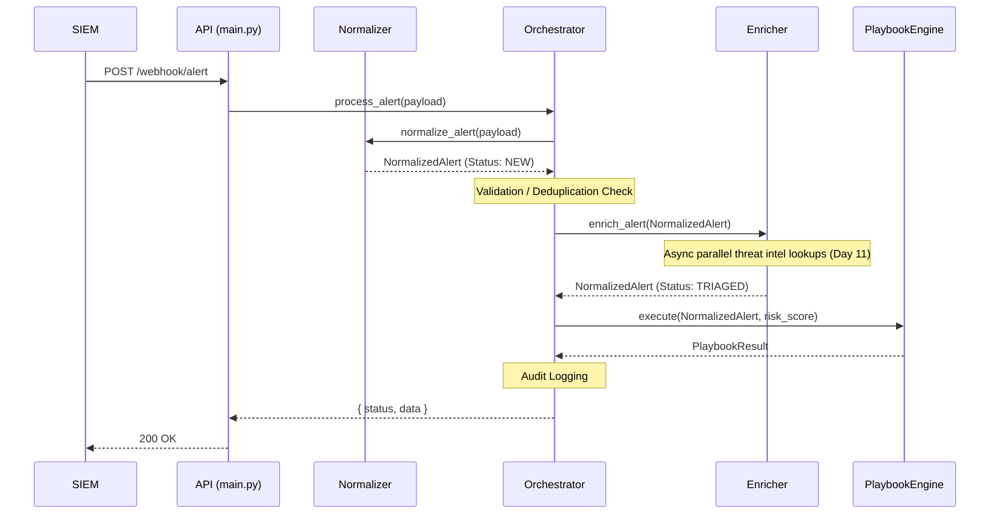

# SOARVault Orchestration Flow

This document details the asynchronous pipeline executed by the SOARVault Orchestrator when a raw SIEM alert is ingested via the webhook.

## Pipeline Architecture

The Incident Orchestrator is responsible for moving an alert through several distinct phases:
1. **Ingestion & Normalization:** Converting a raw SIEM payload into a canonical `NormalizedAlert`.
2. **Enrichment:** Adding threat intelligence metadata (Risk Score, AbuseIPDB, VirusTotal, Geolocation).
3. **Playbook Execution:** Triggering containment playbooks based on the alert type and risk score.
4. **Dashboard Updates:** (Coming soon) Syncing state with the front-end dashboard.

## Sequence Diagram

## Parallel Execution (Day 11 Optimization)

The orchestrator leverages `asyncio.gather` inside the `enricher` (imported module) and potentially inside batch processing (`/webhook/alerts/batch`) to achieve the sub-5-second latency target.

## Interface Contracts

The orchestrator relies on strict data contracts defined in `ingestion/schema.py`:
* The **Enricher** receives a `NormalizedAlert` and must attach an `EnrichmentData` object to `alert.enrichment`.
* The **PlaybookEngine** receives the enriched alert and the extracted `risk_score` (float) and returns a `PlaybookResult`.
