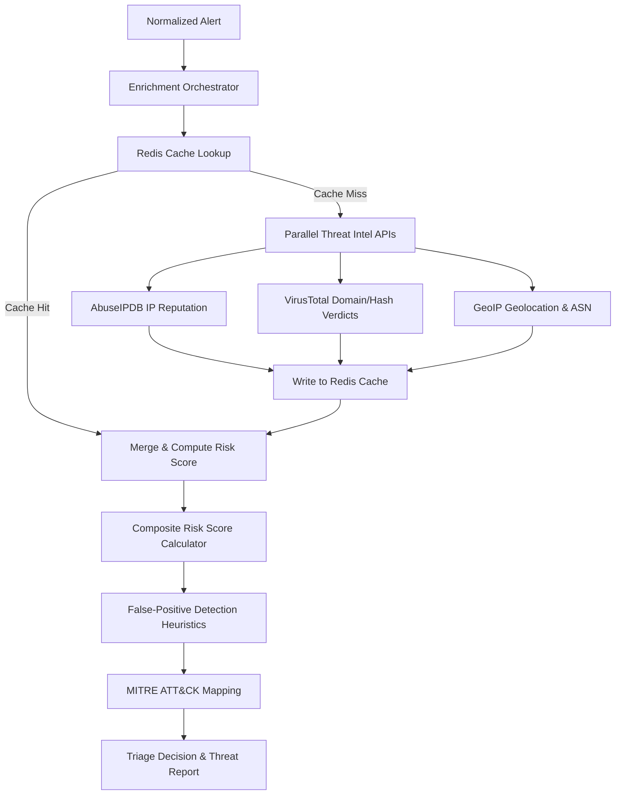

# Threat Intelligence Enrichment Module

This document details the design, architecture, and operation of the Threat Intelligence Enrichment Module in the SOARVault Incident Containment Engine.

## Architecture

The Enrichment Module acts as an intermediary intelligence layer that ingests normalized security alerts and enriches them with reputation, geolocation, historical activity, and threat classification metadata.



## Workflow

1. **Ingest & Parse**: The normalizer extracts IoCs (IP addresses, domain names, file hashes) from raw SIEM events.
2. **Cache Check**: The orchestrator checks Redis for existing cached indicators.
3. **External Fetch**: For cache misses, it queries AbuseIPDB, VirusTotal, and ip-api.com concurrently.
4. **Cache Populate**: Fetched intelligence is saved in Redis with a configurable TTL (default 1 hour).
5. **Scoring**: A composite risk score (0-100) is calculated combining AbuseIPDB reputation, VirusTotal detection ratios, and country-based risk weighting.
6. **False-Positive Analysis**: Evaluates reputation metrics to flag safe IPs (e.g., trusted DNS or CDNs) as Potential False Positives.
7. **MITRE ATT&CK Mapping**: Maps threat attributes to relevant technique and tactic IDs.
8. **Output Generation**: Produces threat reports saved in `enrichment/threat_reports/` and returns the enriched alert payload.

## Data Flow

```
[Raw SIEM Alert JSON] 
       │
       ▼ (Normalization)
[NormalizedAlert Object]
       │
       ▼ (Enrichment Orchestrator)
┌───────────────────────────────────────────────┐
│  - Query Cache / Threat APIs                 │
│  - Calculate composite risk score            │
│  - Detect false positives & map MITRE TTPs   │
└───────────────────────────────────────────────┘
       │
       ▼ (Enriched Object)
[NormalizedAlert.enrichment Populated]
```

## API Integration

- **AbuseIPDB**: Retreives IP threat levels (abuse confidence scores, report counts, ISP, and reporting timeline).
- **VirusTotal**: Submits file hashes and domains to assess malicious reputation based on antivirus verdicts.
- **GeoIP**: Gathers physical location (country, city, latitude/longitude) and Autonomous System Number (ASN) details.

## Risk Scoring

The composite risk score is calculated as follows:
$$Score = (AbuseScore \times 0.5) + (VTRatio \times 100 \times 0.3) + (CountryRisk \times 0.2)$$
- **AbuseIPDB Contribution (50%)**: Linear scaling of the Abuse Confidence Score (0-100).
- **VirusTotal Contribution (30%)**: The ratio of positive engine verdicts over the total engines queried.
- **Country Weighting (20%)**: Risk multiplier based on the geolocated country's cyber threat profile.
- **Repeat Attacker Bonus (+20)**: Added if the source IP is observed frequently in recent threat feeds.
- **Score Cap**: The final score is strictly capped at `100`.

## Country Weighting

Country risk weights are dynamically configured via environment variables:
- `SOARVAULT_HIGHEST_RISK_COUNTRIES` (Weight: 100, contribution: 20 pts. Default: `KP`)
- `SOARVAULT_HIGH_RISK_COUNTRIES` (Weight: 75, contribution: 15 pts. Default: `RU,CN,BY`)
- `SOARVAULT_MEDIUM_RISK_COUNTRIES` (Weight: 50, contribution: 10 pts. Default: `IR,SY,VE,CU,MM`)

## Cache Mechanism

- **Backing Store**: Redis (with a clean fallback to `fakeredis` for test environments).
- **Keyspace**: `cache:ioc:{indicator_value}` containing JSON payload with metadata and `_expires_at` timestamp.
- **TTL**: 3600 seconds (1 hour).

## Folder Structure

```
enrichment/
│
├── __init__.py
├── abuseipdb.py          # AbuseIPDB API client and mock fallback
├── geoip.py              # GeoIP/ASN resolver
├── virustotal.py         # VirusTotal API client
├── risk_scorer.py        # Composite risk scoring formulas
├── cache.py              # Redis cache read/write/flush wrappers
├── threat_actor.py       # Repeat attacker persistence layer
├── threat_summary.py     # Threat report exporter
├── false_positive.py     # False-positive heuristic engine
├── batch_enricher.py     # Concurrent multi-IP enricher
├── mitre_mapper.py       # MITRE ATT&CK framework mapper
│
├── mock_responses/       # Mock JSON payloads for offline execution
└── threat_reports/       # Generated threat intelligence summaries
```

## Example Input/Output

### Input (NormalizedAlert payload snapshot)
```json
{
  "id": "alert-12345",
  "title": "Suspicious External Login",
  "network": {
    "src_ip": "185.220.101.7",
    "dst_ip": "10.0.0.5"
  },
  "iocs": []
}
```

### Output (Enriched alert status snapshot)
```json
{
  "id": "alert-12345",
  "status": "triaged",
  "enrichment": {
    "abuse_score": 90,
    "vt_malicious": 0,
    "vt_total": null,
    "geo_country_code": "RO",
    "geo_country": "Romania",
    "geo_asn_org": "AS9009 (M247 Europe SRL)",
    "repeat_attacker": false,
    "risk_score": 45,
    "false_positive": false,
    "mitre_mappings": []
  }
}
```
